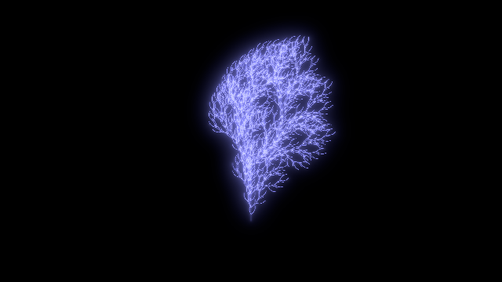
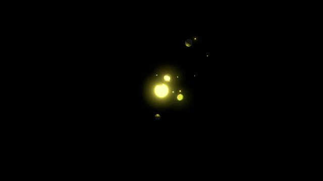
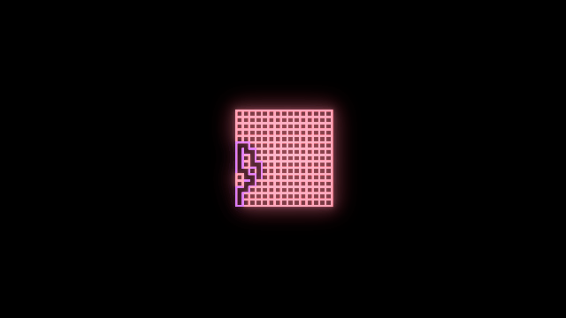
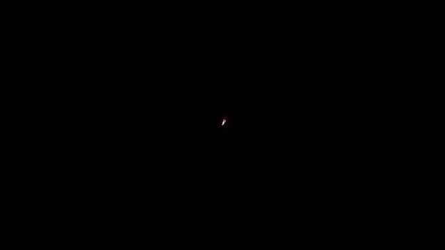
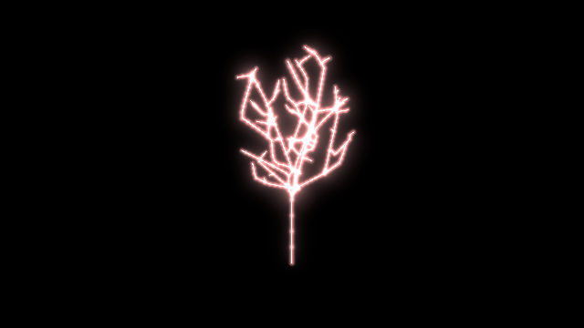

# Coding Train Unity
Coding Train implementations on Unity3d

The playlist with videos of Coding Train:
https://www.youtube.com/channel/UCvjgXvBlbQiydffZU7m1_aw

# L-System

L-System implementation with different rules (Tree, Koch, Serpinsky, Serpinsky Arrowhead)

# Menger Sponge

Menger Sponge implementation with cool rotation and stuff.

# Solar System

Random Solar System generator.

# Maze Generator

Recursive backtracker maze generation algorithm.

# Terrain Generator

Procedural terrain generation with Perlin Noise

# Lorenz Attractor

Lorenz attractor with trail renderer

# Fractal Space Tree Colonization

3D tree generator

# Perlin Flow Field

Partlicle flow field with perlin noise vector (using Keijiro noise implementation)

Also:
* Fractal tree
* Mytosis
* Metaballs